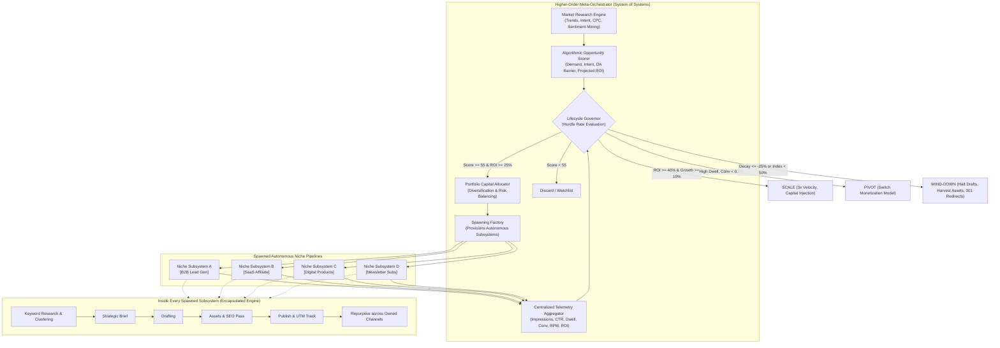
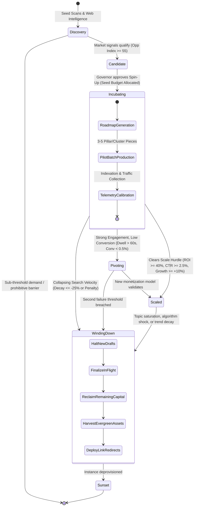
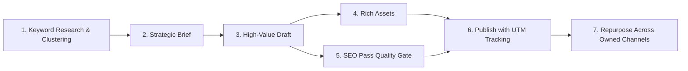
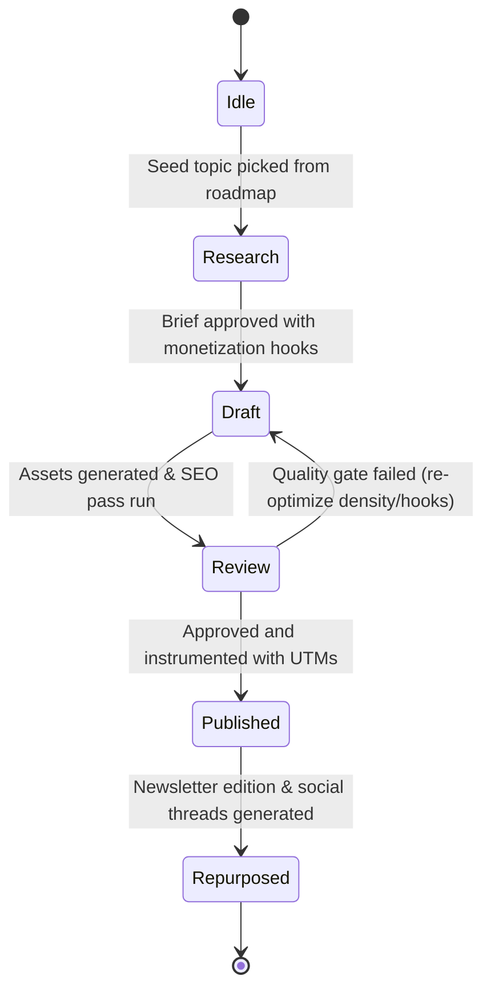

# Distributed Content Management

<p align="center">
  <a href="https://opensource.org/licenses/MIT"></a>
  <a href="https://www.python.org/"></a>
  <a href="#8-quickstart--usage"></a>
  <a href="#1-executive-summary-the-higher-order-architecture"></a>
  <a href="CONTRIBUTING.md"></a>
  <a href="https://github.com/holman57/distributed-content-management/stargazers"></a>
</p>

An autonomous, data-driven meta-system for discovering profitable niches, spawning dedicated content generation pipelines, and dynamically governing multiple monetization streams through their full lifecycle.

> [!TIP]
> **Why this matters**: Rather than building manual content sites one at a time, this framework treats content generation as an autonomous **System of Systems**—algorithmically finding buyer-intent gaps, deploying encapsulated pipeline workers, and making data-backed decisions to scale winners and sunset decaying niches.

---

## Table of Contents

- [1. Executive Summary: The Higher-Order Architecture](#1-executive-summary-the-higher-order-architecture)
- [2. Higher-Order Niche Lifecycle State Machine](#2-higher-order-niche-lifecycle-state-machine)
- [3. Autonomous Market Research Component](#3-autonomous-market-research-component)
- [4. Multi-Stream Monetization Architecture](#4-multi-stream-monetization-architecture)
- [5. Data-Driven Spin-Up & Wind-Down Governance Matrix](#5-data-driven-spin-up--wind-down-governance-matrix)
- [6. Encapsulated Content Pipeline & Lifecycle](#6-encapsulated-content-pipeline--lifecycle-inside-each-spawned-subsystem)
- [7. Repository Codebase Structure](#7-repository-codebase-structure)
- [8. Quickstart & Usage](#8-quickstart--usage)
- [9. Contributing](#9-contributing)
- [10. License](#10-license)

---

## 1. Executive Summary: The Higher-Order Architecture

Previously, this repository outlined a standalone **Content Pipeline** and **Content Lifecycle** designed for a single niche channel. 

In this upgraded system, that entire 7-step process is **encapsulated as an autonomous worker subsystem (`NichePipelineInstance`)**. Above these subsystems sits the **Higher-Order Meta-Orchestrator ("System of Spawning Systems")** equipped with its own **Market Research Engine** and a **Data-Driven Lifecycle Governor**. 

This meta-orchestrator continuously discovers emerging niches, evaluates unit economics, dynamically provisions new pipeline instances, balances a multi-stream monetization portfolio, scales breakout performers, pivots underperforming monetization models, and winds down decaying verticals.



---

## 2. Higher-Order Niche Lifecycle State Machine

While individual content pieces move through their local lifecycle (`Idle -> Research -> Draft -> Review -> Published -> Repurposed`), each **niche pipeline instance** itself is governed by a higher-order macro lifecycle:



---

## 3. Autonomous Market Research Component

The market research subsystem autonomously continuously identifies and qualifies niche opportunities before capital or compute is committed.

### Data Signal Ingestion
The engine ingests and cross-correlates quantitative and qualitative signals across five vectors:
1. **Search Volume & Velocity**: Analyzes 90-day search momentum, YoY growth percentage, and breakout query spikes (Google Trends, search volume feeds).
2. **Buyer Intent Syntax**: Detects transactional/commercial modifiers (`best X for Y`, `X vs Y`, `review`, `pricing`, `alternatives`, `how to fix X`). General-interest informational queries are down-weighted.
3. **Monetization Multipliers**: Evaluates commercial CPC bids, SaaS affiliate bounty rates, average order values (AOV), and digital product pricing floors.
4. **Competitive Saturation & DA Barriers**: Examines top-10 SERP competitors, measuring average Domain Authority (DA), publication freshness, and technical content gaps.
5. **Audience Grievance Mining**: Scrapes Reddit, YouTube comments, and forum communities for pain-point density (`broken`, `struggling with`, `recommendations`) to validate willingness to pay.

### Algorithmic Opportunity Formula

$$\text{Demand Index} = \min\left(100, \left(\frac{\log_{10}(\text{Volume})}{5} \times 100\right) \times (1 + \text{Growth Rate})\right)$$

$$\text{Intent Index} = (\text{Buyer Intent Ratio} \times 60) + \left(\frac{\text{CPC}}{6.0} \times 40\right)$$

$$\text{Competition Barrier} = (\text{Difficulty} \times 60) + (\text{Avg DA} \times 0.40)$$

$$\text{Composite Opportunity Score} = \frac{(\text{Demand Index} \times 0.35) + (\text{Intent Index} \times 0.40) + (\text{Pain Density} \times 25.0)}{1.0 + \left(\frac{\text{Competition Barrier}}{100.0} \times 0.5\right)}$$

---

## 4. Multi-Stream Monetization Architecture

Spawned content pipelines are purposefully mapped to diverse monetization vehicles. The higher-order orchestrator maintains portfolio balance to insulate the business from single-platform dependency (e.g., affiliate policy shifts, ad network rate drops):

| Monetization Model | Optimal Market Signals | Target RPM Benchmark | Primary Content Vehicle | Target Audience & CTA |
| :--- | :--- | :--- | :--- | :--- |
| **B2B Lead Generation** | High CPC ($4.50+), low volume, high intent | **$95.00 - $250.00** | Architectural guides, compliance teardowns, RFP templates | Engineering / Ops buyers; "Schedule 15-min Architecture Audit" |
| **SaaS / Tech Affiliate** | High commercial intent ("best", "vs", "review") | **$35.00 - $120.00** | Benchmark comparisons, head-to-head teardowns, alternatives | Practitioners & teams; "Check Vetted Partner Pricing & Discounts" |
| **Digital Products / Toolkits** | High pain-point density, troubleshooting focus | **$50.00 - $90.00** | Implementation blueprints, boilerplates, config checklists | Self-serve builders; "Download Production-Ready Boilerplate ($49)" |
| **Newsletter / Subscriptions** | High repeat interest, passionate community | **$25.00 - $45.00** | Deep-dive weekly field reports, curated industry dispatch | Long-term subscribers; "Join 15,000+ Engineers on Substack" |
| **Programmatic Ads** | Enormous search volume (>50k/mo), broad appeal | **$15.00 - $28.00** | Comprehensive encyclopedic tutorials, broad guides | General consumer search; High dwell-time media embeds |

---

## 5. Data-Driven Spin-Up & Wind-Down Governance Matrix

The **Lifecycle Governor** acts as an impartial capital allocator. It evaluates active telemetry against strict mathematical hurdle rates:

```
                                 [ TELEMETRY EVALUATION ]
                                            │
        ┌───────────────────────────────────┼───────────────────────────────────┐
        ▼                                   ▼                                   ▼
┌───────────────────┐               ┌───────────────────┐               ┌───────────────────┐
│  SCALE DECISION   │               │  PIVOT DECISION   │               │ WIND-DOWN DECISION│
├───────────────────┤               ├───────────────────┤               ├───────────────────┤
│ • Published >= 3  │               │ • Clicks >= 1,500 │               │ • Published >= 3  │
│ • ROI >= +40%     │               │ • Dwell >= 60s    │               │ • Indexation < 50%│
│ • CTR >= 2.5%     │               │ • Conv < 0.50%    │               │   OR              │
│ • MoM Growth >=10%│               │                   │               │ • Decay <= -25% & │
│                   │               │                   │               │   ROI <= -35%     │
├───────────────────┤               ├───────────────────┤               ├───────────────────┤
│ Action:           │               │ Action:           │               │ Action:           │
│ +$1,200 Capital   │               │ Switch vehicle to │               │ Freeze production,│
│ 3x Publishing Vel │               │ Digital Product   │               │ Reclaim capital,  │
│ Expand clusters   │               │ or Lead Capture   │               │ 301 Redirects     │
└───────────────────┘               └───────────────────┘               └───────────────────┘
```

### Wind-Down & Asset Harvesting Protocol
When an instance triggers `WIND_DOWN`:
1. **Immediate Production Freeze**: In-flight briefs and drafts are halted; remaining allocated capital is returned to the master pool.
2. **Evergreen Asset Harvesting**: Infographics, comparison charts, and code boilerplates are extracted and cataloged into a shared asset library for cross-niche repurposing.
3. **Link Equity Preservation**: Decommissioned URLs are mapped to relevant active hubs via permanent 301 redirects, transferring accumulated domain authority and preventing 404 leakage.
4. **Audience Consolidation**: Captured email subscribers are migrated to the master syndicated publication.

---

## 6. Encapsulated Content Pipeline & Lifecycle (Inside Each Spawned Subsystem)

Each spawned pipeline runs the 7-step production flow and 5-stage lifecycle scoped to its vertical:

### Encapsulated Content Pipeline


### Encapsulated Content Lifecycle


---

## 7. Repository Codebase Structure

```
distributed-content-management/
├── pyproject.toml                         # Modern Python package configuration
├── README.md                              # System architecture, diagrams & framework guide
├── src/
│   └── distributed_content/
│       ├── __init__.py                    # Top-level API exports
│       ├── models/
│       │   ├── __init__.py
│       │   ├── niche.py                   # Niche, MarketSignal, OpportunityScore, NicheLifecycleState
│       │   ├── monetization.py            # MonetizationType, MonetizationConfig, MonetizationProfile
│       │   ├── content.py                 # ContentItem, ContentState, ContentBrief, Asset, SEOReport
│       │   └── metrics.py                 # PerformanceMetrics, LifecycleAction, LifecycleDecision
│       ├── market_research/
│       │   ├── __init__.py
│       │   ├── signals.py                 # MarketSignalCollector (Trends, CPC, search intent, pain density)
│       │   ├── analyzer.py                # Feasibility analyzer & monetization model selection
│       │   └── scorer.py                  # OpportunityScorer (Algorithmic opportunity index & ROI projection)
│       ├── decision_engine/
│       │   ├── __init__.py
│       │   ├── rules.py                   # GovernanceThresholds (Hurdle rates for spin-up, scale, pivot, exit)
│       │   └── governor.py                # LifecycleGovernor (Data-driven decision engine)
│       ├── pipeline/
│       │   ├── __init__.py
│       │   ├── instance.py                # NichePipelineInstance (Encapsulated worker subsystem)
│       │   └── steps/
│       │       ├── __init__.py
│       │       ├── keyword_research.py    # Step 1: Roadmap & topic cluster prioritization
│       │       ├── brief_builder.py       # Step 2: Content brief with monetization hooks
│       │       ├── generator.py           # Step 3: High-value drafting engine
│       │       ├── seo_assets.py          # Steps 4 & 5: Asset generation & SEO quality gate
│       │       ├── publisher.py           # Step 6: Multi-channel deployment & UTM tracking
│       │       └── repurposer.py          # Step 7: Repurposing into newsletter & social scripts
│       └── orchestrator/
│           ├── __init__.py
│           ├── registry.py                # Active & archived pipeline instances directory
│           ├── portfolio.py               # PortfolioManager (Capital allocation & diversification)
│           └── meta_orchestrator.py       # MetaOrchestrator (System of Spawning Systems)
├── examples/
│   └── run_portfolio_simulation.py        # Complete end-to-end executable demonstration
└── tests/
    ├── __init__.py
    ├── test_market_research.py            # Unit tests for signal collection & scoring
    ├── test_pipeline_instance.py          # Unit tests for encapsulated pipeline & lifecycle
    ├── test_decision_governor.py          # Unit tests for spin-up, scale, pivot, and wind-down logic
    └── test_orchestrator.py               # Unit tests for multi-niche spawning & portfolio governance
```

---

## 8. Quickstart & Usage

### 1. Run Automated Unit Tests
The test suite validates market research scoring, the encapsulated pipeline lifecycle, the decision governor, and the higher-order orchestrator:

```powershell
python -m unittest discover tests
```

### 2. Run the Full Portfolio Simulation
Execute the end-to-end demonstration showcasing market research discovery, automated subsystem spawning, multi-channel execution, real-time telemetry, data-driven scale/pivot/wind-down decisions, and portfolio risk analysis:

```powershell
python examples/run_portfolio_simulation.py
```

### 3. Programmatic Usage in Python

```python
from src.distributed_content import MetaOrchestrator

# Initialize the System of Spawning Systems
orchestrator = MetaOrchestrator()

# 1. Autonomous Market Research
niche = orchestrator.discover_niche(
    niche_id="niche-devops",
    name="Self-Hosted Cloud Infrastructure",
    vertical="DevOps & Security",
    seed_keywords=[
        "best self-hosted cloud storage for privacy",
        "nextcloud vs owncloud benchmarks",
        "how to fix nextcloud sync error",
    ],
)

print(f"Opportunity Score: {niche.opportunity_score.composite_score}/100")
print(f"Recommended Vehicle: {niche.opportunity_score.recommended_monetization.value}")

# 2. Spawn Encapsulated Pipeline Subsystem
instance = orchestrator.spawn_pipeline_instance(niche, initial_budget=600.0)

# 3. Simulate Operations & Ingest Telemetry
instance.update_telemetry(
    simulated_impressions=35000,
    simulated_clicks=1800,
    simulated_conversions=28,
    revenue_per_conversion=65.0, # $1,820 revenue
)
instance.metrics.traffic_growth_rate = 0.25

# 4. Execute Higher-Order Governance
decisions = orchestrator.evaluate_and_govern_active_pipelines()
for decision in decisions:
    print(f"Subsystem: {decision.niche_id} -> Action: {decision.action.value.upper()}")
    print(f"Rationale: {decision.rationale}")

# 5. Review Portfolio Health Ledger
summary = orchestrator.get_portfolio_summary()
print(f"Blended Portfolio ROI: +{summary['blended_roi_pct']}%")
```

---

## 9. Contributing

Contributions, feature proposals, and bug reports are welcome!

1. **Fork the Repository** (`gh repo fork holman57/distributed-content-management` or via GitHub web UI).
2. **Create a Feature Branch** (`git checkout -b feature/emerging-channel-adapter`).
3. **Write Tests & Implement** (Ensure `python -m unittest discover tests` passes with 100% coverage).
4. **Commit Changes** (`git commit -m 'Add support for programmatic Substack sync'`).
5. **Push & Open a Pull Request** against `main`.

See [CONTRIBUTING.md](CONTRIBUTING.md) for full style conventions and architectural design patterns.

---

## 10. Show Your Support

If you find this autonomous architecture useful or inspiring, please consider giving it a **⭐ Star** and **🍴 Forking** the repository! It helps other developers and creators discover the framework.

---

## 11. License

This project is licensed under the [MIT License](LICENSE).

